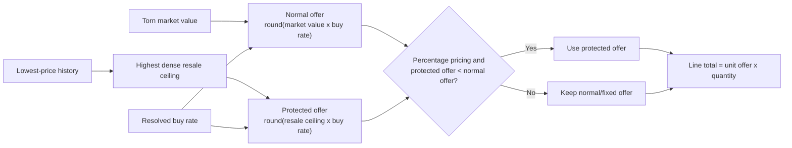

# Item Tracking — Log → Flow Definitions

## Plushie Set points checker

The Tampermonkey calculator (`tampermonkey/points-checker.user.js`) is a read-only market
decision aid and creates no inventory flows. It gets all data from `GET /api/points-checker`,
so no Torn API key or third-party database credential is stored in the browser. The endpoint
uses the canonical set in `museum-exchange.json`, the latest recorded Point Market offer,
catalog market values, and low/high item-market observations for the current Asia/Manila day.
Missing observations are returned as `null` rather than being treated as zero.
The drawer scopes its table foreground and background colors so Torn's global table styles do
not reduce contrast on the dark calculator panel.
Separate tabs calculate the canonical Plushie Set and Exotic Flower Set. The current Point
Market offer pre-fills an editable expected sale-price field; changing it recalculates profit
locally for both tabs and does not alter server data.

The **spec layer** for the inventory management system: for every Torn log type we care
about, define the **item flows** (what leaves your inventory, what arrives, money/points
side effects), the **conditions** that decide which flows apply, and the **quantity**
expressions. Tools implement this spec — the portfolio tracker (see `ITEM_EXTRACTION.md`) and the
inventory monitor (`inventory-monitor/`, see `INVENTORY_MONITOR.md`) do today.

Game-rule background (transformations, museum, trades): see `GAME_MECHANICS.md`.

## Item-market auto-buy watchlist synchronization

`tampermonkey/item-market-buy.user.js` stores its shopping/watchlist settings locally under
`tmItemMarketBuySettings` and attempts to copy the complete settings object to the hosted
`itemmarket` section of `GET/PUT /api/sync`. Cross-device synchronization depends on both devices
having **Cloud sync** enabled and being able to reach that endpoint.

The userscript uses `https://itrade.devs.surf/api/sync`, which is reachable through the public
HTTPS reverse proxy on desktop and mobile; it does not use the raw server IP and port. The cloud
status displays success only after a 2xx response and displays an error for a non-2xx response,
network failure, or timeout. The server-side sync store is process memory only, is cleared by an
app restart, and uses one unauthenticated shared `itemmarket` namespace rather than a per-account
key.

### Bazaar Sniper market source

The Bazaar Sniper in `tampermonkey/item-market-buy.user.js` uses the same Weav3r marketplace
request as `tampermonkey/market-pulse.user.js`:
`GET https://weav3r.dev/api/marketplace/{itemId}?limit=100`. Both therefore begin with the same
100-listing market window ordered by numeric unit price. The sniper additionally validates player
id, price, and quantity, then locally applies its watchlist price cap, configurable freshness
limit, visited-seller cooldown, available cash, skipped state, and target-quantity state before
navigating to a seller. These automation-only safety filters can make its actionable subset
smaller than the informational list shown by Market Pulse.

The **Enable Bazaar Sniper** switch independently controls Weav3r scanning, Bazaar navigation,
and buying. The separate **Auto-buy** switch controls only Item Market buying; it is not a hidden
prerequisite for the Bazaar Sniper. **Controller only** still prevents automation on that device.

---

## Flow schema

Each log yields zero or more **flows**:

```json
{
  "logType": 2340,
  "title": "Item use empty blood bag",
  "conditions": [
    { "field": "data.faction", "op": "==", "value": 0 }
  ],
  "flows": [
    { "direction": "out", "item": "data.item",  "qty": "data.quantity || 1" },
    { "direction": "in",  "item": "data.blood_bag", "qty": 1 }
  ]
}
```

- `direction`: `in` = +qty to inventory · `out` = −qty from inventory.
- `item`: either a literal item id, a log field path (`data.blood_bag`), a synthetic
  pseudo-id (`__points__`, `__ammo__…`, `__set__…`), or a lookup (museum set → items).
- `qty`: a literal number or a path expression (`data.quantity || 1`).
- `money` / `points`: optional side-effect fields (not inventory items, tracked separately).

---

## 1. Buy / Sell — item flows with money

Buy log types: **1103, 1112, 1220, 1225, 4201, 4200, 5010** · store from `LOG_TYPE_STORE`.
Sell log types: **1104, 1113, 1221, 1226, 4210, 4220, 5011**.

| Log group | Flows |
|---|---|
| Buy | `in` item (`data.item[0].id` or `data.item` number), qty `data.quantity \|\| 1`, money `−data.cost_total` |
| Sell | `out` item, qty same, money `+data.cost_total` (already **net of market tax**) |
| Points (5010 buy / 5011 sell) | item = pseudo `__points__`, qty, money ∓ cost |

- `data.item` may be `[{id, qty}]` (take first), a number, or fall back to `data.items[0].id`.
- Buy from **Bazaar** and **Point Market** are tax-exempt; Item Market sells are taxed.
- **FIFO cost capture:** for buy logs, `data.cost_total` is stored as the FIFO lot `unit_cost`
  (cost per unit = `cost_total / qty`). Free items (`FREE_LOG_TYPES`) receive `unit_cost = 0`;
  trade items receive a proportional cost share using market-value weights (post-batch).

### 1b. Ammo market — buy (4500) / sell (4510)

Ammo uses a **flat data shape** (not `data.item`) and maps to the `__ammo__` pseudo-item namespace:

| Log | Direction | Source | Data shape |
|---|---|---|---|
| 4500 Ammo buy | `in` | `Ammo Buy` | `{ ammo: <typeId>, quantity: <rounds>, value: <$> }` |
| 4510 Ammo sell | `out` | `Ammo Sell` | same |

- Item id: pseudo `__ammo__<typeId>__0` — same namespace as ammo received from crimes/stocks
  (which use a nested `{type:{size:qty}}` shape), but size is always `0` in the buy/sell log.
- `data.value` is the total money paid/received — not tracked as an inventory flow.
- **4520 Ammo priority** — preference setting only, no inventory flow.
- ⚠️ Ammo **consumed during fights** has no Torn log type — it cannot be tracked via logs.
  See `GAME_MECHANICS.md` §13.

---

## 2. Free items — income (no money)

Log groups + source labels: see `ITEM_EXTRACTION.md` §5. Every one of them is a plain
**`in` flow** of item(s) at qty from the log data, resolved through the extractor shapes:

| `data` shape | Item id source | Qty |
|---|---|---|
| `ammo_gained` / `ammo` = `{type:{size:qty}}` | pseudo `__ammo__<type>__<size>` | value |
| `items_gained` = `{itemId: qty}` | each key | value |
| `items` object = `{itemId: qty}` | each key | value |
| `items` array = `[{id, qty}]` | each `id` | `qty \|\| 1` |
| `item` array = `[{id, qty}]` | each `id` | `qty \|\| 1` |
| `item` number | it | `data.quantity \|\| 1` |
| `egg` number | it | 1 |
| `set` string (log 7000 — see §4) | pseudo `__set__<name>` | `data.quantity \|\| 1` |

**8946 Christmas town coupon exchange** also lands here (source `Christmas Town`): its
`data.items = {itemId: qty}` is the items **received** for spending coupons — `in` each
entry. The coupon spend itself (a seasonal currency, `"5 coupons"` string, no item id) is
not an inventory flow.

**7900 Missions buy reward item** (source `Missions`) — purchasing a reward item from the
Missions shop using mission credits. Shape: `data.item = <id>` (number), `data.quantity`,
`data.credits_spent`. The `credits_spent` field is not an inventory flow — only the item
arriving is tracked as `in`.

**Faction loan receive (6746)** — item enters personal inventory from the faction armory → `in`.
The companion log 6745 "Faction loan item send" is **not** an inventory flow (see below).

---

## 2b. Faction loan send (6745) — no inventory flow

When a faction loan is created, **two log entries** appear on the initiating member's log:

- **6746** Faction loan item receive → `in` (item enters personal inventory from faction armory)
- **6745** Faction loan item send → **no flow** (item left the faction armory, never personal inventory)

When a member loans an item to themselves, both appear on the same log. Only 6746 generates
a flow. 6745 is excluded from `USAGE_LOG_TYPES` to prevent a false `out` on personal inventory.

Loan return flows (item leaves personal inventory back to faction armory):
- **6749** Faction loan item retrieve → `out` (source: `Faction Loan Retrieve`)
- **6747** Faction loan item return → `out` (source: `Faction Loan Return`)

See `GAME_MECHANICS.md` §11 for the full loan lifecycle.

---

## 3. Item use — consumption & transformations

Usage log groups + sources: see `ITEM_EXTRACTION.md` §6 (Consumed, Dumped, Parceled, Sent,
Faction…, OC Spent, Crime Spent/Loss, Relic Perish, Staff Removal).

**Ledger tracking:** all `USAGE_LOG_TYPES` now also emit `side: 'use'` transaction records
in the Ledger tab (via `logUsageTransactionEvents` in `src/ledger/transactions.js`). Channel
is derived from `USAGE_SOURCE_TO_CHANNEL` in `src/constants.js`:
- `usage` — Consumed, Dumped, Crime Loss/Spent, Relic Perish, Staff Removal
- `gift` — Sent (4100/4102/4104), Parceled (4000), Faction Given (6732), Faction Payout (6796)
- `faction` — Faction Armory deposit/claim (6725/6728/6750), Loan Return (6747), OC Spent (6768/6769)
- `museum` — Museum Swap (7000)

These rows carry `total_price = null` (no monetary value) and do not affect the running balance.

### Base rule (pure consumption)

- Default: **`out`** of `data.item`, qty `data.quantity || 1` (e.g. the 2xxx Consumed ids in
  `USAGE_LOG_GROUPS` + easter eggs 8981–8989, Dumped 1400/1403, Sent 4100/4102/4104, …).

### Condition — faction armory use

- **If `data.faction != 0`** on a `Consumed` log: the item came from the faction armory →
  **no inventory flow** for the player (tracked separately as armory use).
- Same exclusion applies in `logUsageTransactionEvents` — no ledger row is emitted for
  armory-consumed items.
- `faction == 0` (or absent) → normal `out` flow from own inventory.

### Transformations (net effect)

| Log | Condition | Flows |
|---|---|---|
| 2340 Item use empty blood bag | `faction == 0` | `out` `data.item` (empty bag) **+ `in` `data.blood_bag`** (filled bag, qty 1) |
| 2340 … | `faction != 0` | no player flow (armory) |
| 2340 … | `armory_deposit` set | `in` lands in the armory instead of the player inventory → **the player only sees the `out` flow** (decided; implemented in the inventory monitor) |
| 2390 Item use drug pack | `faction == 0` | `out` `data.item` (pack, qty 1) **+ `in` `data.item2`** × `data.quantity` (e.g. pack 370 → drug 205 × 10) |
| 2400 Item use goodie bag | `faction == 0` | `out` `data.item` (bag) **+ `in` each `data.items`** (array `[{id, qty}]`) |
| 2480 Item use dukes safe | `faction == 0` | `out` `data.item` (safe) **+ `in` `data.item2`** (empty safe, qty 1) |
| 2535 Item use halloween basket | `faction == 0` | `out` `data.item` (basket) **+ `in` each `data.items`** (object `{id: qty}`) |
| any container log | `faction != 0` | no player flow (armory) |

> Container-opening rule (`item2` / `items`): when a use log carries **`data.item2`** the
> `quantity` belongs to the **result** item, not the container — `out container ×1`,
> `in item2 × quantity`. When it carries an **`items`** array/object (goodie bag,
> halloween basket) each entry is received. Source label `Opened`.

> Implementation status: the **inventory monitor** implements the full transformation
> (out + in, incl. the `armory_deposit` rule and the `item2`/`items` container rule). The
> portfolio tracker still implements only the `out` half.

---

## 4. Museum exchange (log 7000)

- `out` **one of each** item in the set's composition (from `museum-exchange.json`),
  × `data.quantity`.
- `points` side-effect: `+data.points_received`.
- Item identity: synthetic `__set__<data.set>` for display; the real deduction is the
  composition list. Conditions: none (museum is always own inventory).
- The monitor records the reward as a **swap event** (`set`, `quantity`, `points_received`)
  for the **Museum** tab — see `INVENTORY_MONITOR.md` §4h.

---

## 5. Trades — grouped by trade id

Group all sub-logs by `data.parsed_trade_id` (anchor log 4430), then:

| Sub-log | Side | Flows |
|---|---|---|
| 4440 money outgoing | gave | money `−d.money` |
| 4441 money incoming | received | money `+d.money` |
| 4445 items outgoing | gave | `out` each `{id, qty}` |
| 4446 items incoming | received | `in` each `{id, qty}` |
| 4450 property outgoing | gave | property out (not an item flow) |
| 4451 property incoming | received | property in (not an item flow) |

- Item quantities **sum per item id** within the side.
- Ignore draft add/remove logs (4442/4443, 4447/4448) and share/NAP/faction/company
  trade logs — they don't represent completed item exchanges.
- Verified real Torn shape: trade sub-logs carry `details.id` (no top-level `log` field),
  `data.user` (counterpart), `data.parsed_trade_id` (numeric) and `data.items` as
  `[{ id, uid, qty }]` — all handled by the monitor's extraction.
- The monitor's main ledger applies 4445 as `out` and 4446 as `in` (both source `Trade`),
  so they appear in the Monitor IN/OUT tables. It also **groups the sub-logs by
  `parsed_trade_id`** (4430 anchor + 4440/4441 money + 4445/4446 items + 4450/4451
  property) into **You Gave / You Received** sides for the **Trading** tab (expandable
  detail rows, money + properties included) — see `INVENTORY_MONITOR.md` §4g.

---

### 5b. Trading FIFO profit monitor (hosted Trading system)

The hosted Trading admin area has a separate, log-derived **Trading FIFO** view at
`/admin/trading-profit`. Its purpose is commercial activity and realized trading performance, not reconstruction
of the player's complete inventory. It therefore accepts only these movements:

| Commercial event | Trading FIFO effect |
|---|---|
| Item/bazaar/shop purchase log | Open an incoming FIFO lot at the logged total cost |
| Completed trade: items received and money given | Open incoming lots; prefer receipt item prices, otherwise allocate money by item market-value weight |
| Bazaar/item-market/shop sale log | Match the outgoing quantity against the oldest open lots for that item |
| Completed trade: items given and money received | Match outgoing items against the oldest lots; allocate proceeds by item market-value weight |
| Museum exchange (7000) | Consume canonical inventory FIFO lots as a non-sale `museum` outflow |
| Use/gift/faction/other permanent outflow | Consume canonical inventory FIFO lots as a non-sale `use` outflow so remaining lots stay aligned |

Acquisition and depletion quantities follow the Inventory Monitor's canonical `fifo_lots` and
`transactions`, including free acquisitions, use, gifts, faction movements, transformations,
Museum conversions, and reconciliation. Only commercial buy/trade-in and sell/trade-out rows
contribute to the Trading dashboard's purchase, revenue, and profit measures. Listing an item is
not a sale; the sell log is the outgoing commercial event.

The Trading dashboard uses the same remaining lots as `/admin/inventory`, rather than maintaining
a second commercial-only quantity model. A sale without sufficient canonical FIFO history is an
**unmatched sale** with unknown cost basis; it must not be silently assigned a `$0` cost.

The item table can be filtered by Torn item category as well as item name and report date. A
**Current lots only** toggle is enabled by default and hides items whose present canonical FIFO
balance is zero; disabling it restores fully depleted and unmatched-sale items. Category and
current-balance filters are applied on the server before totals, sorting, and lazy pagination, so
summary cards and result counts describe the visible filtered result set. The current-lot test is
independent of the report date because it answers whether the item is held now, while the date
range continues to control the displayed purchase and sale activity.

On narrow mobile screens, the item table becomes a compact summary showing item, realized profit,
and current remaining quantity. Tapping a row expands the detail panel directly beneath it, where
the bought quantity, purchase cost, sold quantity, revenue, FIFO cost, profit, margin, current
lot counts, remaining units, and open cost basis are available before the lot tabs. Desktop keeps
the complete sortable table.
The compact row uses a fixed mobile grid, so inserting or removing the expanded detail panel never
changes the widths of its item, profit, remaining, or expand columns.
Those compact-grid rules apply only to the outer item table; expanded lot and activity tables keep
their full column structure and use horizontal scrolling on narrow screens.

Realized profit is calculated only for matched quantity:

```
realized profit = allocated sale proceeds - sum(FIFO matched quantity × lot unit cost)
```

The UI lives under the authenticated Trading system (alongside Manage and Receipts) and
is primarily an **item profit dashboard**. Its default workflow is: select a date preset or custom
range, search/select an item, then see quantity bought, purchase cost, quantity sold, sales
revenue, realized FIFO cost, realized profit, margin, remaining trading quantity, and remaining
cost basis. Summary cards show cash spent, revenue, realized profit, margin, open cost basis, and
unmatched sale quantity. The main item table uses one row per item and can be sorted by profit,
revenue, quantity sold, or remaining cost basis; clicking a row expands its detail panel directly
beneath that item, showing its buy/sell timeline and the FIFO lots consumed by each sale. Opening
another item moves the single detail panel beneath that row. A secondary chronological Activity view supports auditing
all incoming and outgoing events.

The initial filters should stay small and prominent: date (Today, 7D, 30D, This Month, All, or
custom range) and item-name autocomplete. Advanced filters for channel and direction can live in
a collapsible panel. Filters apply together, active filters are visible as removable chips, and a
single Reset action restores the default. Date filtering determines which sale events contribute
to realized revenue/profit, but the cost of those sales must still be matched against acquisition
lots from before the selected range. Purchases shown for the range and FIFO cost consumed in the
range are therefore intentionally different measures and must have distinct labels/tooltips.
Period `Bought` and `Purchase cost` include commercial buy/trade-in events but not inventory
reconciliation lots. A period sale can therefore consume much older, lower-cost lots: its FIFO
cost must use those historical costs even when newly bought items in the selected period have a
substantially higher average price. Current `Remaining` and `Open basis` still come from all
presently open canonical lots, including reconciliation lots.

Profit should be presented conservatively. `Realized profit` covers sold, FIFO-matched quantity
only; unsold lots appear under open quantity/cost basis and do not count as profit. If a sale is
partly or fully unmatched, the UI shows the known matched profit plus an `Incomplete cost basis`
warning instead of treating the missing cost as zero. Negative profit is red, positive profit is
green, and neutral/unknown values do not use either success color.
In lot rows, an em dash (`—`) under Revenue or Profit means the lot has no sold quantity and the
value is not applicable; it is not a minus sign or a negative amount.

Each item's detail view must also expose the FIFO lots directly, with **Open Lots**, **Sold
Lots**, **Converted**, and **All Lots** tabs. An open-lot row shows acquisition date/source, original quantity,
sold quantity, remaining quantity, unit cost, original cost, and remaining cost basis. A
fully-sold lot shows the same acquisition fields plus the final depletion date, total proceeds
attributed to its matched units, realized profit, margin, and links/expanders for every sale that
consumed it. A partially sold acquisition appears in Open Lots with both sold and remaining
quantities and in All Lots as one lot; it must not be displayed as two unrelated acquisitions.
Museum-depleted quantities appear in their own Converted column and tab. A fully depleted lot is
labelled Converted when all depletion came from Museum exchanges, Sold when it came from sales,
or Mixed when both occurred. Museum quantities reduce remaining lots and cost basis but never add
sales revenue or realized profit.

Conversely, expanding a sale shows all acquisition lots it consumed, including quantity and cost
drawn from each lot. This makes the relationship auditable in both directions: acquisition lot →
sales and sale → acquisition lots. The item header summarizes open lots, fully sold lots,
partially sold lots, remaining units, and remaining cost basis. Lot status is derived from
`remaining_qty`: Open when it equals original quantity, Partial when it is between zero and the
original quantity, and Sold when it is zero. Date filters apply to sale/profit reporting, while
the Open Lots tab reflects the current lot state; a clear `As of now` label prevents the two time
contexts from being confused.

Persistence is in the hosted database: `trading_events`, `trading_fifo_lots`, and
`trading_fifo_matches` are reporting tables derived from the Inventory Monitor's canonical
`fifo_lots` and `transactions`. `services/trading-profit.js` first enriches Trade lots and Trade
buy transactions from matching completed receipt item `effective_price` values, then replays all
canonical acquisitions and outflows chronologically for sale-to-lot profit matching. The copied
lot's final `qty_remaining` is taken directly from Inventory Monitor so both pages show the same
open lots. The full 15-minute portfolio sync refreshes the report, and the authenticated page also
provides a manual Rebuild action. Torn logs remain the source of truth for whether and when the
trade completed; receipts supply the exact agreed per-item buy prices.

The current implementation follows all retained Inventory Monitor history and its reconciliation
lots. Stock sold before that history can still appear unmatched.

The production front end is implemented by
`public/admin/trading-ledger-wireframe.html`, `.css`, and `.js`. The interface provides date
presets/custom dates, item-name filtering, aggregate
profit cards, the per-item profit table, and item detail tabs for Open Lots, Sold Lots, All Lots,
and Activity. Data comes from authenticated `/admin/api/trading-profit/*` endpoints; calculations
come from the persisted production accounting implementation described above. Its CSS and
JavaScript references are relative to the HTML asset, while the production page itself is served
through the authenticated `/admin/trading-profit` route.

The item table is server-paginated in batches of 50 and lot tabs in batches of 30. An
`IntersectionObserver` requests the next batch as the corresponding Load More control approaches
the viewport; the controls also remain directly clickable. Sorting is performed by whitelisted
server columns so it covers unloaded rows as well as visible rows. Items default to latest
activity date descending, while each lot tab defaults to acquisition date descending. Clicking
any sortable heading reverses its direction; selecting a new heading uses descending order except
for item name, which starts ascending. Native `loading="lazy"` is also set on item images.

---

## 6. Reference data files

| File | Use |
|---|---|
| `museum-exchange.json` | set name → item ids + base points (museum deductions) |
| `torn_items.json` | item id → name / type / market price (resolve names & value) |
| `log_types.json` | log type id → title (resolve log titles) |

---

## 6b. Inventory state model (current = baseline + flows)

Logs only record **movement** — they can't tell you what you held *before* the tracking
window. Any log-driven inventory therefore needs a **baseline** at the start point:

```
current = baseline(startTs) + Σ in flows − Σ out flows
```

Decisions (implemented in the inventory monitor, `INVENTORY_MONITOR.md` §4b):

- The monitor's baseline is **zero** (delta-only ledger): `current = net` per item.
  `net > 0` → in stock; `net < 0` → **overdrawn** (consumed pre-existing stock, true
  balance unknown). The ledger becomes a real inventory as activity accumulates.
- Alternative baselines (not implemented): one-time seed from a trusted snapshot, or a
  manual starting-quantity table.

---

## 6c. Bazaar stock flows (separate ledger)

The **Bazaar** is its own stock location (`GAME_MECHANICS.md` §5). Bazaar-scoped flows —
**relative to bazaar stock**, not the person inventory:

| Log | Bazaar direction | Notes |
|---|---|---|
| 1210 / 1222 Bazaar add | `in` | item stocked on the bazaar (also leaves the player inventory) |
| 1221 / 1226 Bazaar sell | `out` | another player bought it → money `+data.cost_total` (revenue) |
| 1211 / 1223 Bazaar remove | `out` | taken off the bazaar back to the player inventory |

- Implemented as a **separate ledger** in the inventory monitor (`state.bazaar`), but the
  main person-inventory ledger **stays aligned**: bazaar **add** → inventory `out`,
  bazaar **remove** → inventory `in`, bazaar **sell** → *no* inventory flow (the item
  already left inventory when it was stocked — so 1221/1226 are **not** treated as regular
  sells in the monitor's main ledger; the portfolio tracker still treats them as "Sell").
- Bazaar flows also appear in the shared activity feed tagged `Bazaar Sold` / `Bazaar
  Added` / `Bazaar Removed`; the inventory-side moves appear as `Bazaar Add` / `Bazaar
  Remove`. Every bazaar move is also recorded as a **transfer event** (location→location,
  e.g. `Inventory → Bazaar`, `Bazaar → Sold`) for the Transfers view.

---

## 6d. Display Case flows (separate ledger)

The **Display Case** is its own stock location (`GAME_MECHANICS.md` §6). Display-scoped
flows — **relative to display stock**, not the person inventory:

| Log | Display direction | Notes |
|---|---|---|
| 1300 / 1302 Display add | `in` | item placed on the display (also leaves the player inventory) |
| 1301 / 1303 Display remove | `out` | taken off the display back to the player inventory |

- Implemented as a **separate ledger** in the inventory monitor (`state.display`); no money
  is involved. The main person-inventory ledger stays aligned: display **add** → inventory
  `out`, display **remove** → inventory `in`.
- Display flows appear in the shared activity feed tagged `Display Added` / `Display
  Removed`; the inventory-side moves appear as `Display Add` / `Display Remove`. Each move
  is also recorded as a **transfer event** (`Inventory → Display`, `Display → Inventory`).

### 6e. Item Market listing ledger

The **Item Market listing** is a fourth location — items you list for sale to other players
(`GAME_MECHANICS.md` §7):

| Log | Direction | Meaning |
|---|---|---|
| 1100 / 1110 Item market add | listing `in` | item listed → moved **out of the player inventory** (`Inventory → Market`) |
| 1104 / 1113 Item market sell | listing `out` | another player bought the listing → money (`cost_total`, net of market tax); **no inventory flow** |
| 1101 / 1111 Item market remove | listing `out` | listing taken down → item **back into the player inventory** (`Market → Inventory`) |

- Implemented as a **separate ledger** in the inventory monitor (`state.market`, with
  `revenue` + `unitsSold` aggregates). The main person-inventory ledger stays aligned:
  market **add** → inventory `out`, market **remove** → inventory `in`, market **sell** →
  no inventory flow (the item already left inventory when listed). Consequently the monitor
  excludes 1104/1113 from its Sell group (the portfolio tracker still treats them as
  "Sell").
- Market flows appear in the shared activity feed tagged `Market Added` / `Market Sold` /
  `Market Removed`; the inventory-side moves appear as `Market Add` / `Market Remove`. Each
  move is also recorded as a **transfer event** (`Inventory → Market`, `Market → Inventory`,
  `Market → Sold`).

### 6f. Torn Points ledger (`__points__` pseudo-item)

Torn Points are tracked as the pseudo-item `__points__` ("Torn Points" in the UI), so their
balance behaves like any other item in the Monitor/Inventory ledger:

| Log | Direction | Source (activity / popup) |
|---|---|---|
| 5010 Points market buy | `in` | `Buy` |
| 5011 Points market sell | — | **no inventory flow** (points already left when listed, 5000) |
| 5000 Points market add (listing) | `out` | `Points Market Add` |
| 5001 Points market remove | `in` | `Points Market Remove` |
| 4900–4975 Points usage (refills, unlocks, merits) | `out` | `Points Used: <kind>` (qty = `data.points_used`; skipped when `data.faction` is set — faction-armory points) |
| 7000 Museum exchange | `in` | `Museum: <set>` (qty = `data.points_received`, alongside the set-item `out` flows) |

- Same alignment rule as the item/bazaar/market ledgers: **selling** points (5011) is not an
  inventory flow — the points left your wallet at listing time (5000 add → `out`, 5001 remove
  → `in`).
- **5011 now fetched:** log type 5011 (points market sell) is included in `ALL_LOG_TYPES` and
  `NO_FLOW_TYPES` — it triggers no inventory flow but emits a **transaction record** in the
  ledger (channel `points_market`, side `sell`), so revenue from point sales appears in the
  Ledger tab.
- `data.points_used` is the authoritative cost (e.g. `{"points_used": 30, "energy_increased": 150}`);
  if the refill was paid from faction points the log carries a `faction` value → no player flow.
- Museum conversions add the earned points as `in` **and** the set items as `out` in the same
  log (one swap → points in + items out).

### 6g. Virus programming (5802)

Programming a virus is time-based (nothing consumed) — **completion creates the virus**:

| Log | Direction | Source | Notes |
|---|---|---|---|
| 5802 Virus programming complete | `in` | `Virus Programming` | qty 1; the item is resolved **by name** from `data.virus` (`"a simple"` → item 69 Simple Virus, `"a firewalk"` → 103, `"a polymorphic"` → 70 — any catalog item ending in "Virus") |
| 5800 start / 5801 cancel | — | — | no item flow |

- The name→id map is built from the catalog (items whose name ends in "Virus"); an
  unresolvable type logs a warning and produces no flow.

### 6h. Racing — car enlist / unenlist (8700 / 8701)

The racing garage is a "location" for your cars (like bazaar/display/market for items):

| Log | Direction | Source | Notes |
|---|---|---|---|
| 8700 Racing enlist car | `out` | `Racing Enlist` | car (`data.car` item id) leaves inventory for the garage |
| 8701 Racing unenlist car | `in` | `Racing Unenlist` | car back in inventory |

---

## 7. Open questions / TODO

- [x] Transformation `in` half for log 2340 — implemented in the **inventory monitor**
      (`inventory-monitor/server.js`); still pending in the portfolio tracker (see §3 note).
- [x] `armory_deposit` semantics — decided: the transformation result lands in the armory,
      so the player only gets the `out` flow (§3).
- [ ] Decide how "created" items display in the portfolio tracker (source label vs
      `+qty` marker) — irrelevant for the inventory monitor (flows are the model).
- [x] Machine-readable flow spec — implemented as code in `inventory-monitor/server.js`
      (`logFlows()`), with extraction shapes documented in `INVENTORY_MONITOR.md` §4.

---

## 8. Trade-page pricing automation

`tampermonkey/trade-automation.user.js` is an operational companion to the
receipt tool. It does not infer inventory movements or replace Torn logs as the
source of truth. When explicitly enabled, it processes the current-trade queue
oldest-expiring first, tells the counterpart to add their items, and waits for
the configurable timeout (60 seconds by default). Chat replies
and confirmation keywords do not gate pricing. At the deadline it requests a
server preview of the current trade contents. If the preview contains one or
more items and the quoted total does not exceed cash on hand, it creates a
receipt using the server catalog's effective prices, posts the receipt URL and
total, adds that total as the local side's trade money, posts a thank-you
comment after the money form returns, and then returns to the current-trade
list. If the preview contains no items,
the job enters a resumable `waiting_for_items` stage: no receipt is created, no
total is posted, and no money is added. The selected reactive trade remains
under observation across refreshes. Once an item appears, the job returns to a
ten-second quiet-period wait and then retries pricing. **Skip Trade** remains
available if the operator wants to stop waiting and continue the queue.

After preview pricing and before receipt creation, the automation compares the
quoted total with the player's current cash-on-hand value from Torn's
`#user-money` header element (`data-money`, falling back to its displayed text).
If the total exceeds available cash, it creates no receipt and adds no money.
Instead it posts the configurable insufficient-cash comment and enters
`waiting_for_adjustment`. The default comment tells the counterpart how much
cash is available and asks them to adjust the items. Its supported placeholders
are `{cash}`, `{total}`, `{shortfall}`, and `{tradeId}`. When the counterpart's
item signature changes, the normal ten-second quiet period runs and the trade
is preview-priced again. **Price Now** is also available in this stage for a
manual retry (for example, after cash on hand changes without an item change).
If Torn's cash element is temporarily unavailable, the cash gate is skipped so
the existing pricing flow is not blocked by incomplete page rendering.

Receipt previews include both the newest recorded item-market lowest offer and
the daily highest-dense resale ceiling selected from `item_market` history.
Before the cash check and receipt creation, the preview endpoint automatically
applies low-market protection whenever the daily resale ceiling is below
Torn market value; there is no configurable drop trigger. Whether protection is
eligible follows a separate three-level configuration cascade:
`item protection override -> category protection override -> global protection
default`. Category and item values are nullable so clearing an override restores
inheritance. Existing installations migrate with global protection enabled,
preserving the behavior that predated these controls.

Trade Price Management shows the receipt shield at all three levels. Green means
the effective protection state is enabled and gray means disabled; a dashed shield
is inherited, while a solid shield is an explicit setting. Clicking a global
shield toggles its default. Clicking a category or item shield stores the opposite
of its current effective state as an explicit override, and the adjacent reset
control returns it to its parent. Category protection can be configured without a
category percentage, and item protection can be retained on a hidden listing.

Trade Admin stores public visibility separately from explicit item pricing. If an
item has a fixed-price or custom-percentage override and is then unchecked, its
`trade_listings` row remains with `is_active=false`: it is hidden from the public
trade listing but its item-level price still wins over category/global fallback
for receipt pricing. Receipt preview reports it as `in_catalog=false`, preserving
the unlisted-item warning and negotiation message. Unchecked items without an
explicit override are removed as before.
For an enabled, affected percentage-priced item, the same resolved buy percentage is applied to
that resale ceiling instead of market value, and only when this reduces the
quote. For example, an 80% buy rate with market value $100 and highest dense level $70
quotes $56 rather than $80. Explicit fixed-price listings are never changed.
Items without stored lowest-offer history continue through the existing price
cascade. The adjusted item prices are sent as receipt overrides, so the receipt,
cash sufficiency check, posted total, and added trade money all use the protected
amount.

In formula form, the normal unit offer is `round(market_value * buy_rate)` and the
protected unit offer is `round(resale_ceiling * buy_rate)`. Protection is marked
only when the item uses percentage pricing, all three inputs are positive,
`resale_ceiling < market_value`, and the protected offer is strictly lower than
the normal offer. The reported drop percentage is
`(market_value - resale_ceiling) / market_value * 100`; it is audit/display data,
not a threshold test. Quantity affects only the line total (`protected unit offer *
quantity`), not the unit-price decision.



The market sync retains every successful lowest-price poll, including unchanged
prices, so daily density is meaningful. Receipt protection groups observations
from the current Asia/Manila calendar day into fixed-anchor bands using a 1% margin.
Each band starts at its lowest price and includes observations no more than 1%
above that anchor; neighboring steps cannot chain into a wider band.

A band qualifies as dense when it contains at least 5% of all valid polls that day,
with an absolute minimum of three observations. Among qualifying bands, the band
with the highest median price wins, and that median becomes the resale ceiling. A
single high spike therefore cannot disable protection, while a repeatedly observed
upper price region can. If the history is too sparse for any band to meet the
minimum, the densest available band is used, with the higher median winning a tie.
If an item has no observation today, the same process uses its most recent tracked
day. The raw newest observation remains available separately for audit.

This reference deliberately measures the highest credible resale region rather
than technical-analysis support. For Panda Plushie on 2026-08-25, the repeated
upper cluster around `$49,000` is selected instead of the denser `$45,300` region
or a one-off maximum. Because that highest dense level is above Torn market value,
the item is not protected under the resale-opportunity rule.

When protection applies, its audit fields are carried in `items_override` and
stored with the receipt item: the unprotected offer, highest-dense resale ceiling,
observed market drop, resolved buy percentage, and final
protected unit price. The public receipt marks the affected price with a shield
icon. Hovering the icon, or focusing it with a keyboard, shows short help text
explaining that the day's highest credible resale level was unusually below market value;
the page-level tooltip dynamically opens above or below the shield so table
overflow cannot clip it. The compact calculation section shows each protected
item as a Market → Ceiling → Offer flow with the original offer struck through;
unprotected pricing rules are summarized as small percentage/fixed-price chips.
The calculation-row shield has a detailed hover/keyboard tooltip containing the
selected tracking date, dense-band and total poll counts when available, market-value drop,
buy rate, and original-versus-protected unit offer.
The standalone `tampermonkey/trade-receipt.user.js` preview also marks protected
rows with a red shield and a compact ceiling/drop/original-offer line. Its native
hover/keyboard help contains the same audit context. Confirming an untouched row
passes the protection audit fields into receipt creation; manually editing its
fixed/% offer dims the shield and intentionally replaces automatic protection.
On the public receipt, each protected item also has a graph button beside its
name. It opens a responsive modal patterned after the Bazaar Pricer chart and
loads every lowest-offer poll from the item's selected Asia/Manila tracking day.
The graph overlays the jagged lowest-offer history with horizontal Highest Dense
Level and Torn Market Value lines, and displays the winning dense-band sample
count. The modal supports button, backdrop, and Escape-key closing; unprotected
items do not show the graph control.
Trade Automation also switches to an editable protected-price
comment containing the receipt URL and adjusted total, warning the counterpart
to review the lower offer and inviting negotiation. Separate editable templates
cover protection alone and the combined protected-plus-unlisted case so the
unlisted warning is not lost. They support `{url}`, `{total}`,
`{protectedCount}`, `{unlistedCount}`, and `{tradeId}` as applicable.

### Local receipt fixture mode

Receipt preview/create can be tested locally without a real Torn trade by
setting `RECEIPT_FIXTURE_MODE=true` outside production. The reserved trade id
defaults to `99999999` (`RECEIPT_FIXTURE_TRADE_ID` can change it), and the
default fixture is `tests/fixtures/receipt-trade.json`
(`RECEIPT_FIXTURE_FILE` can select another file). Fixture loading is ignored
whenever `NODE_ENV=production`, and receipt endpoints still require the normal
`X-Receipt-Token`; arbitrary request bodies cannot inject trade contents. The
fixture must use Torn's `trade.user`, `trade.trader`, and `trade.items[]` shape.
Its item ids are resolved and priced through the real local catalog, listing,
lowest-offer history, protection, and receipt persistence paths.

The userscript's editable **Pricing server URL** defaults to
`https://itrade.devs.surf` and may be changed to `http://localhost:3001`; its
metadata permits `localhost` and `127.0.0.1`. This redirects preview, creation,
receipt links, and completion consistently. A fake id can exercise the local
receipt API, but it cannot create a fake Torn trade page or DOM; end-to-end
comment, money-form, and acceptance automation still requires a real disposable
Torn trade. The bundled fixture is therefore intended for API/receipt pricing
tests, including fake `item_market` observations.
For command-free testing, fixture mode also exposes `/receipt-test`. This local
client keeps the pasted token only in page memory and can create an exact-id
fake lowest-offer row, run protected preview pricing, create/open the receipt,
and delete the fake market row plus fixture receipt. Its helper routes are
token-protected, return 404 outside fixture mode, and the cleanup receipt route
refuses any trade id other than the configured reserved fixture id.
Fixture mode additionally exposes `/trade-simulator`, a local stateful trade
harness. It can replace the reserved fixture trade's seller items in memory,
create/remove an exact-id fake lowest offer, run the real protected preview and
receipt-creation endpoints, simulate the cash gate and outgoing message, and set
the displayed trade money. After preview, each item offer can keep the server
price or be adjusted to a fixed unit price or percentage of Torn market value;
applying adjustments recreates the receipt and total with the corresponding
override metadata. The simulator can mark the quote accepted and invalidates
acceptance when items or offer controls change so the revision must be applied
or repriced. Reset removes the fake
market row and fixture receipt and restores the file-backed fixture. The page
and its mutation helpers are unavailable outside fixture mode and require the
receipt token; the production Torn workflow is never mocked or modified.

For the bundled fake trade, enable the two `.env` values, restart the local
server, and send an authenticated preview request with the reserved id:

```powershell
$headers = @{ 'X-Receipt-Token' = 'YOUR_LOCAL_RECEIPT_TOKEN' }
$body = @{ trade_id = 99999999 } | ConvertTo-Json
Invoke-RestMethod -Method Post -Uri http://localhost:3001/api/receipt/preview `
  -Headers $headers -ContentType 'application/json' -Body $body
```

The returned items and total already contain any protected calculations. A
create request may reuse those item prices and protection audit fields as
`items_override`; unlike preview, creation persists a local receipt row.
The local `torn_tracker` database must have the trade schemas applied in order:
`trade-schema.sql`, `trade-schema-v2.sql`, then
`trade-schema-receipts.sql`. All three are idempotent and include upgrade
columns required by the current routes (`category_order` and receipt
`short_id`), so rerunning them does not clear existing listings or receipts.
The Trade Admin profile drawer reads the token from authenticated
`GET /api/receipt/token`. Its **Regenerate** control calls
`POST /api/receipt/token/regenerate`, immediately replacing the UUID; any
userscript or test command using the previous token must then be updated.

The manual `tampermonkey/trade-receipt.user.js` preview editor supports a
per-item pricing mode. **Fixed** treats the entered value as the exact unit
offer; **Market %** treats it as a percentage of that row's Torn market value
and recalculates the unit offer, subtotal, and receipt total live. Switching
modes preserves the current offer by converting it to the closest equivalent
fixed value or percentage. Confirmation sends the selected override mode and
decimal percentage with the unit price, so the stored receipt's pricing mode,
percentage badge, and calculation explanation match what the operator chose.

The waiting deadline adapts to Torn's reactive item updates. With no detected
counterpart item, the configured default deadline is retained. When the
counterpart item area or a counterpart "added Nx ... to the trade" log entry
first indicates an item, the remaining wait becomes a ten-second quiet period.
Every subsequent item-signature change restarts that ten-second period, capped
by the original default deadline. This refreshes the timer only; it does not
refresh the Torn page.

The active trade and each transition are persisted before comments, form
submissions, and navigation. This makes page reloads and Torn's hash-based
redirects resumable. A trade id enters persistent completed history only after
the second manual acceptance reaches `step=accept2`; those completed ids are
skipped by both DOM and API discovery on later runs and expire after 30 days.
Empty, timed-out, interrupted, reset, or partially processed trades never enter
that history. Only a manual **Skip Trade** uses a five-minute trade-id cooldown
to prevent immediate reselection loops. All
seven outgoing comment templates (item request, standard receipt, unlisted
receipt, protected receipt, combined protected-plus-unlisted receipt,
insufficient cash, and thank-you) are managed in the userscript settings. The
standard receipt comment supports `{url}`, `{total}`,
and `{tradeId}` placeholders. When any server-preview item has
`in_catalog: false`, the automation uses the separate configurable unlisted-item
receipt comment instead. Its short default warns that unlisted items received
lower offers, asks the counterpart to review before accepting, and invites
negotiation; it supports `{url}`, `{total}`, `{unlistedCount}`, and `{tradeId}`.
Torn comments remain limited to 155 characters. Incoming-trade discovery watches the reactive global status
icon whose `/trade.php` link has an `aria-label` beginning with `Trade pending:`.

The authenticated receipt-admin page keeps its loaded receipt set in memory and
supports instant text search across trade/receipt ids, buyer/seller names and ids,
and status. Inclusive **From**/**To** date inputs filter by receipt creation time
in the browser's local timezone; search and dates combine, Clear resets all
filters, and the receipt counts and volume are recalculated from the visible set.
Status edits update the in-memory record and reapply the active filters.
The Inventory Monitor's `trade_events` table is the authority for whether a Torn trade completed.
Any receipt with no row for the same Torn trade id receives a 10-minute synchronization grace
period from receipt creation, then changes to the existing `cancelled` status on reconciliation.
During those first 10 minutes an unmatched receipt is authoritatively `pending` and the public
receipt displays `In Progress`, overriding an incorrect manual Completed or Cancelled selection.
If a receipt does have a matching completed Inventory Monitor trade, it is `completed` and receives
a completion timestamp. Inventory Monitor is authoritative regardless of the receipt's current or
manually selected status: every unmatched receipt becomes `cancelled`, and every matched receipt
becomes `completed`. Thus **Check Receipts** corrects an intentionally or accidentally incorrect
manual status in either direction once the cancellation grace has elapsed. Completion never waits
for the grace period. Reconciliation also runs at the start of every one-minute hosted
scheduler cycle and immediately before the authenticated receipt list is returned, so the
potentially longer market-item sync cannot delay receipt status changes.
The public receipt polls while Pending and renders the reconciled state explicitly: Completed is
green, Cancelled is red, and only Pending is labeled `In Progress`. When polling observes a final
state it updates the pill and stops polling; Cancelled is never presented as still in progress.
The receipt-list header also provides **Check Receipts**, which runs the same reconciliation on
demand, reloads the list, and reports how many pending receipts were cancelled.
The receipt list loads the newest 20 rows first and requests additional 20-row pages as its bottom
sentinel approaches the viewport. Search and inclusive date filters execute on the server, reset
the paging cursor, and keep status/volume totals accurate across the entire filtered result set.
The userscript is restricted to `https://www.torn.com/trade.php*`, so discovery,
the status panel, and all automation operate only while a trade page is open.
If a pending alert appears while an already-open trade list is stale, that list
is refreshed exactly once. The alert label is persisted as a latch so the same
notification cannot create a reload loop. No background trade-list requests
are made. Movement between the list, selected-trade, and add-money views uses
Torn's hash routes only. A missing alert must remain absent for five seconds
before the latch resets, covering transient header rebuilds; selected trade and
add-money routes are never refreshed by the alert listener.
As an optional discovery source, the userscript polls Torn API v2
`GET /user/trades?cat=ongoing` while enabled and idle. It requires a
limited-access Torn API key configured in Settings, defaults to a 30-second
interval (minimum 15 seconds), and selects the ongoing trade with the earliest
`expires_at`. This API poller supplements the status-icon/list discovery and
does not cache returned trade ids. Every poll includes a Unix-millisecond `_`
query parameter so browsers and intermediary caches see a unique request URL;
this does not override caching intentionally enforced by Torn's API servers.
Polling stops when no Torn trade page is open because the userscript is not
loaded on other pages.
Tampermonkey metadata explicitly grants cross-origin connections to both
`api.torn.com` for discovery and `itrade.devs.surf` for receipt preview,
creation, and completion. Pricing-server network and timeout errors are labeled
separately in the floating status panel.
The Settings dialog also provides **Reset Automation**. After confirmation it
restores the default timeout and messages, disables automation, and clears the
active job, completed-trade history, pending-alert/navigation latches, and
locked-trade cooldowns. The Tampermonkey menu also exposes **Clear Completed
Trade History** independently for retesting.

Completed-history and lock handling are both keyed by Torn **trade id**, never
by counterpart user id. If the selected page reports "This trade is currently
locked. Please wait" before pricing/payment is complete, that trade id receives
a separate five-minute cooldown. DOM and API discovery ignore it during the
cooldown, after which it is eligible for retry; it is not marked completed.
The cooldown can be cleared from the Tampermonkey menu with **Clear Locked Trade
Cooldowns**. Lock detection scans the selected trade container's complete
visible text rather than depending on a specific alert class. While any job is
active, the floating panel also exposes **Skip Trade**, which manually applies
the same trade-id-specific five-minute cooldown and clears the active job.
The automation applies that skip behavior automatically when the selected page contains Torn's
terminal `No trade was found. It may have expired...` message: it defers that trade id for five
minutes, clears the job, returns to the trade list, and continues with another trade. This check
runs before normal stage handling, so the missing trade cannot remain stuck retrying comments,
pricing, money, or acceptance.
The floating automation status and settings panel is anchored at the top-right
of the viewport.
While a trade is in the waiting stage, that panel displays **Price Now**. A
manual click moves the stored deadline to the current time, causing the next
tick to check for items and advance immediately instead of waiting for the
remaining countdown.
The intended hash target is persisted before navigation and guarded for 60
seconds, preventing a document startup from repeatedly issuing the same route
transition if Torn rebuilds or reloads the page.
Comment submission accepts Torn's historical `#postTradeMessage` field as well
as current `name="post"`, inserter-form, and comment-panel input/textarea
variants. Native value setters and bubbled input/change events are applied for
the actual control type before the form is submitted. The comment submit
control has its disabled property, attribute, and disabled styling removed,
then the actual Torn `ADD` control is clicked (rather than using the browser's
`requestSubmit()` shortcut). Because Torn renders
these route controls asynchronously, DOM-dependent stages wait without error
until their comment, add-money link, or money form exists. Receipt creation is
also deferred until the comment form is present, avoiding duplicate receipts
caused by render-timing retries.
Before any item-request, receipt, or thank-you comment is submitted, the script
normalizes the intended 155-character message and compares it with comments in
the visible trade log. When Torn exposes the current player id, the comparison
is restricted to that player's comments. An exact existing match advances the
persisted job stage without filling or clicking ADD again, making comment
submission idempotent across unexpected page refreshes.
On the add-money route, the amount is filled first and the intended submission
time is persisted. The actual Torn Change/Add control is clicked no earlier
than one second later.
After Torn returns to the selected trade, the persisted `returning` stage waits
for the asynchronously rendered comment form, posts the editable thank-you
message, and records `thank_posted`. It then enters `awaiting_accept`, visibly
highlights Torn's acceptance control, and pauses for the player's manual input.
The item signature used for the latest server quote remains stored throughout
the receipt, money, thank-you, and acceptance stages. If the counterpart changes
their items after pricing—including after the local player has performed the
first ACCEPT—the changed signature invalidates the pending acceptance and sends
the job back through a ten-second quiet period and server preview. The receipt
is updated, a new receipt/total comment is processed, and the add/change-money
route replaces the local trade amount with the new total before acceptance is
offered again. The same guard runs on both the selected-trade and acceptance
routes, before a trade can be recorded complete.
The first manual ACCEPT moves Torn into reconfirmation; when its legitimate
second ACCEPT becomes enabled, that control is highlighted for a second manual
click. The script neither removes the countdown nor clicks either control.
After Torn reaches `step=accept2`, the receipt is marked complete and the
automation returns to the queue.
